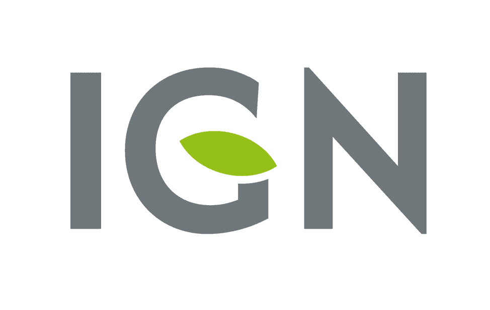

# 🇫🇷 L’IGN – Institut national de l’information géographique et forestière 

L’**IGN (Institut national de l’information géographique et forestière)** est l’organisme public français de référence pour la production et la diffusion des données géographiques et forestières en France.

---

## 🗺️ Missions principales

- 📍 Produire des **cartes officielles** du territoire français  
- 🛰️ Collecter et diffuser des **données géographiques** (satellite, aériennes, GPS)  
- 🌳 Suivre et analyser l’**état des forêts françaises**  
- 📊 Mettre à disposition des **données ouvertes (open data)**  

---

## 🛰️ Domaines d’expertise

- Cartographie numérique  
- Photographie aérienne et images satellites  
- Systèmes d’information géographique (SIG)  
- Modélisation 3D du territoire  
- Inventaire forestier national  

---

## 🌍 Outils et services connus

- **Géoportail** – Visualisation des cartes et données publiques  
- Bases de données géographiques pour les professionnels  
- Applications mobiles de randonnée et de navigation  

---

## 📌 En résumé

L’IGN joue un rôle essentiel dans la connaissance et la gestion du territoire français.  
Ses données sont utilisées par :

- Les collectivités territoriales  
- Les services de l’État  
- Les entreprises  
- Les chercheurs  
- Le grand public  

---

> ✨ L’IGN contribue à une meilleure compréhension de notre environnement et à l’aménagement durable du territoire.